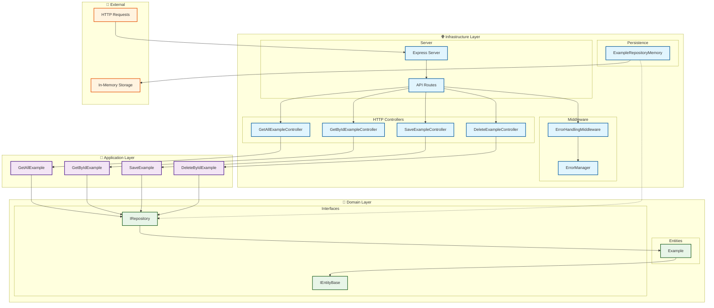

# API Example - Clean Architecture with TypeScript

Una API REST construida con Express.js y TypeScript que implementa Clean Architecture para el manejo de ejemplos (resources).

## 🏗️ Arquitectura

Este proyecto implementa **Clean Architecture** organizando el código en las siguientes capas:

- **Domain**: Entidades y interfaces del núcleo del negocio
- **Application**: Casos de uso y lógica de aplicación
- **Infrastructure**: Controladores HTTP, persistencia y middleware

### 📊 Diagrama de Arquitectura



### 🔄 Flujo de Datos

1. **HTTP Request** → llega al **Express Server**
2. **Express** → enruta la petición a los **API Routes**
3. **Routes** → delega al **Controller** correspondiente
4. **Controller** → ejecuta el **Use Case** (Application Layer)
5. **Use Case** → utiliza el **Repository** a través de interfaces
6. **Repository** → accede a la **persistencia** (memoria/database)
7. **Response** → regresa por las mismas capas hasta el cliente

### 🏛️ Principios de Clean Architecture

- **🎯 Independencia**: Cada capa es independiente y testeable
- **📈 Dependencias**: Las dependencias apuntan hacia adentro (Domain)
- **🔄 Inversión**: Uso de interfaces para invertir dependencias
- **🧩 Separación**: Cada capa tiene una responsabilidad específica

## 📋 Requisitos

- **Node.js** >= 16.0.0
- **npm** >= 8.0.0

## 🚀 Instalación

### 1. Clonar el repositorio

```bash
git clone <repository-url>
cd api-example
```

### 2. Instalar dependencias

```bash
npm install
```

### 3. Configurar variables de entorno

Crea un archivo `.env` en la raíz del proyecto:

```env
APP_ENV=development
PORT=3000
```

Para producción, crea un archivo `.env` con:

```env
APP_ENV=production
PORT=8080
```

## 🏃‍♂️ Ejecución

### Modo desarrollo (con watch)

```bash
npm run dev:watch
```

### Modo desarrollo (compilación manual)

```bash
npm run dev
```

El servidor se ejecutará en `http://localhost:3000` (o el puerto configurado en `.env`).

## 📁 Estructura del Proyecto

```
src/
├── example/
│   ├── domain/
│   │   ├── entity/
│   │   │   └── Example.ts          # Entidad de dominio
│   │   └── interfaces/
│   │       ├── IEntityBase.ts      # Interface base para entidades
│   │       └── IRepository.ts      # Interface del repositorio
│   ├── application/
│   │   ├── GetAllExample.ts        # Caso de uso: obtener todos
│   │   ├── GetByIdExample.ts       # Caso de uso: obtener por ID
│   │   ├── SaveExample.ts          # Caso de uso: crear/guardar
│   │   └── DeleteByIdExample.ts    # Caso de uso: eliminar por ID
│   └── infrastructure/
│       ├── http/
│       │   ├── GetAllExampleController.ts    # Controlador GET all
│       │   ├── GetByIdExampleController.ts   # Controlador GET by ID
│       │   ├── SaveExampleController.ts      # Controlador POST
│       │   └── DeleteExampleController.ts    # Controlador DELETE
│       ├── persistence/
│       │   └── ExampleRepositoryMemory.ts    # Implementación en memoria
│       ├── middleware/
│       │   └── ErrorHandlingMiddleware.ts    # Middleware de errores
│       └── tracing/
│           └── ErrorManager.ts              # Gestor de errores
├── server.ts                               # Configuración del servidor
└── swagger.json                            # Documentación OpenAPI 3.0.3
```

## 📚 Documentación de la API

La API cuenta con documentación completa en formato OpenAPI 3.0.3 disponible en el archivo `swagger.json`. 

### Visualizar la documentación

Puedes visualizar la documentación usando cualquiera de estas opciones:

1. **Swagger UI Online**: 
   - Ve a [Swagger Editor](https://editor.swagger.io/)
   - Copia y pega el contenido de `swagger.json`

2. **Swagger UI Local**: 
   ```bash
   npx swagger-ui-serve swagger.json
   ```

3. **VSCode Extension**: 
   - Instala la extensión "Swagger Viewer"
   - Abre el archivo `swagger.json` y presiona `Shift+Alt+P` → "Preview Swagger"

4. **Integración con el servidor** (próxima implementación):
   ```bash
   npm install swagger-ui-express
   # La documentación estará disponible en http://localhost:3000/api-docs
   ```

## 🔌 Endpoints Disponibles

### Obtener todos los ejemplos
```http
GET /example
```

**Respuesta exitosa (200):**
```json
[
  {
    "id": "1",
    "name": "Ejemplo 1"
  },
  {
    "id": "2",
    "name": "Ejemplo 2"
  }
]
```

### Obtener ejemplo por ID
```http
GET /example/:id
```

**Respuesta exitosa (200):**
```json
{
  "id": "1",
  "name": "Ejemplo 1"
}
```

### Crear nuevo ejemplo
```http
POST /example
Content-Type: application/json

{
  "name": "Nuevo ejemplo"
}
```

**Respuesta exitosa (201):**
```json
{
  "id": "3",
  "name": "Nuevo ejemplo"
}
```

### Eliminar ejemplo por ID
```http
DELETE /example/:id
```

**Respuesta exitosa (200):**
```json
{
  "message": "Ejemplo eliminado correctamente"
}
```

## 🛠️ Tecnologías Utilizadas

### Runtime & Framework
- **Node.js**: Entorno de ejecución
- **Express.js**: Framework web para Node.js
- **TypeScript**: Superset de JavaScript con tipado estático

### Herramientas de Desarrollo
- **nodemon**: Recarga automática en desarrollo
- **ts-node**: Ejecución directa de TypeScript
- **dotenv**: Gestión de variables de entorno

### Características Técnicas
- **Clean Architecture**: Separación clara de responsabilidades
- **Dependency Injection**: Inyección de dependencias manual
- **Error Handling**: Middleware centralizado para manejo de errores
- **Async/Await**: Manejo moderno de operaciones asíncronas
- **In-Memory Storage**: Persistencia en memoria para desarrollo
- **OpenAPI 3.0.3**: Documentación completa de la API con Swagger

## 🔧 Configuración del Proyecto

### Scripts disponibles

- `npm run dev`: Compila TypeScript y ejecuta el servidor
- `npm run dev:watch`: Ejecuta el servidor en modo watch (recarga automática)

### Variables de entorno

| Variable | Descripción | Valores | Por defecto |
|----------|-------------|---------|-------------|
| `APP_ENV` | Entorno de ejecución | `development`, `production` | `development` |
| `PORT` | Puerto del servidor | Cualquier puerto válido | `3000` |

## 🚦 Manejo de Errores

La aplicación incluye un sistema robusto de manejo de errores:

- **Middleware de errores**: Captura y procesa todos los errores
- **Async Handler**: Maneja errores en controladores asíncronos
- **Error Manager**: Gestiona diferentes tipos de errores
- **Logging**: Registra errores para debugging

## 🎯 Principios de Clean Architecture

1. **Independencia de frameworks**: La lógica de negocio no depende de Express
2. **Testabilidad**: Cada capa puede ser probada independientemente
3. **Independencia de la UI**: La API puede cambiar sin afectar el negocio
4. **Independencia de la base de datos**: Fácil cambio de persistencia
5. **Separación de responsabilidades**: Cada capa tiene una responsabilidad específica

## 📈 Próximos Pasos

- [ ] Implementar base de datos real (PostgreSQL/MongoDB)
- [ ] Agregar autenticación y autorización
- [ ] Implementar validación de datos
- [ ] Agregar pruebas unitarias y de integración
- [ ] Implementar logging estructurado
- [x] Agregar documentación OpenAPI/Swagger
- [ ] Implementar CI/CD pipeline

## 🤝 Contribución

1. Fork el proyecto
2. Crea una rama para tu feature (`git checkout -b feature/AmazingFeature`)
3. Commit tus cambios (`git commit -m 'Add some AmazingFeature'`)
4. Push a la rama (`git push origin feature/AmazingFeature`)
5. Abre un Pull Request

## 📝 Licencia

Este proyecto está bajo la Licencia ISC. Ver el archivo `LICENSE` para más detalles.

---

**Hecho con ❤️ usando Clean Architecture y TypeScript** 